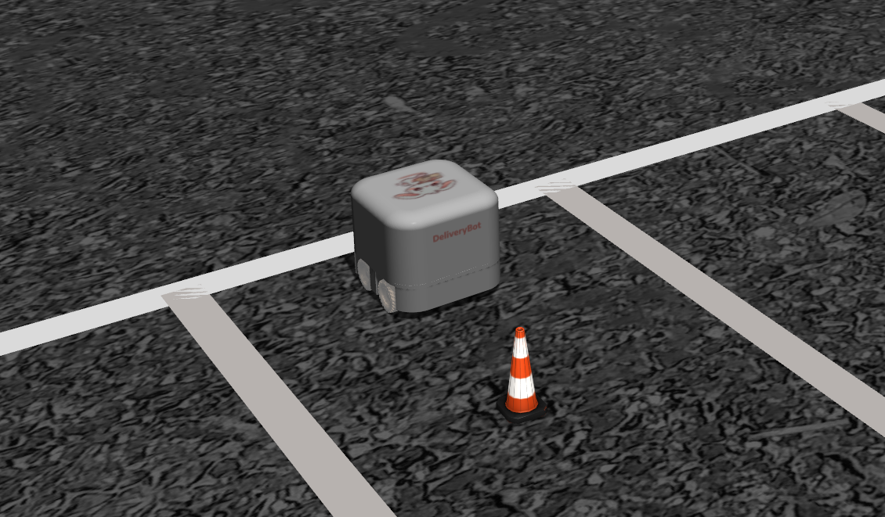

# ros2_deliverybot_ws

### ROS2 DeliveryBot: Autonomous Delivery 
Welcome to the ROS2 DeliveryBot project
I'm developing an autonomous Ackermann steering-controlled delivery robot. All 3D models are custom-made by the author.


### DeliveryBot

This project's goal is to create an autonomous (and possibly the cutest) 4 wheeled Ackermann Steering DeliveryBot that aims to navigate from a parking lot to another goal position, avoiding fixed and moving obstacles. Also, it will be able to perform non holonomic parking.

Final goal is to spawn multiple DeliveryBots and perform fleet management.





#### What's ready:
- Robot Urdf description
- Ackermann steering control
- Joystick teleoperation 

#### What's coming:
- Twistmux for input management (including safety stops)
- Sensor integration (3D lidar, cameras, IMU, radar)
- Improved odometry
- SLAM implementation
- Computer vision for mobile obstacle detection

### Build the workspace
```
cd ros2_deliverybot_ws
colcon build
source ./install/setup.bash
```

### Launch the latest implementation
```
(epmpty world)
ros2 launch deliverybot_bringup deliverybot.launch.py

(ParkingLot world)
ros2 launch deliverybot_bringup deliverybot.launch.py world_name:=ParkingLot

```

### Acknowledgment

This project is part of my portfolio. You can check out more of my work at [Robotics Unveiled / Greta Russi Portfolio ](https://www.roboticsunveiled.com/portfolio/).


