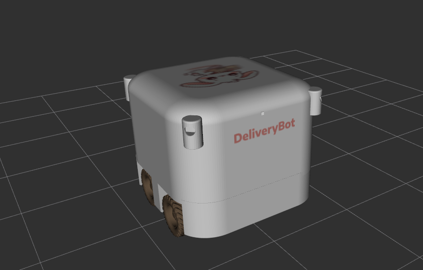
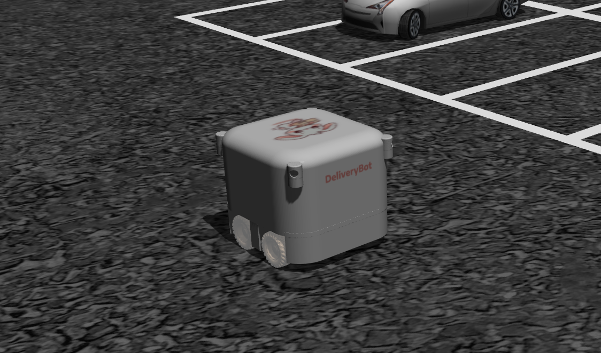
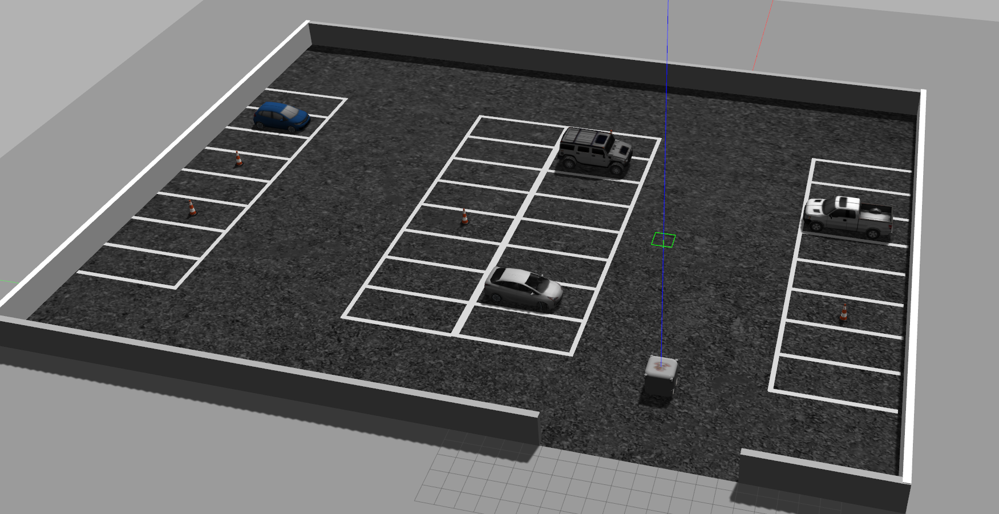
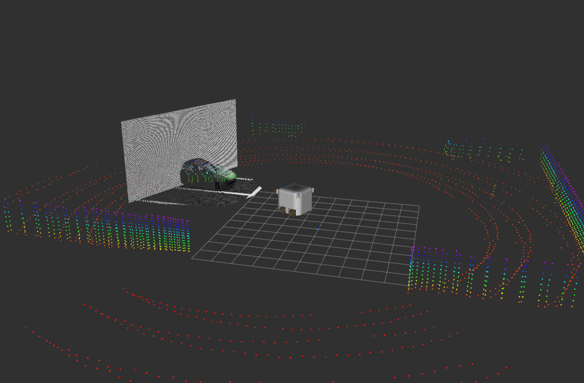
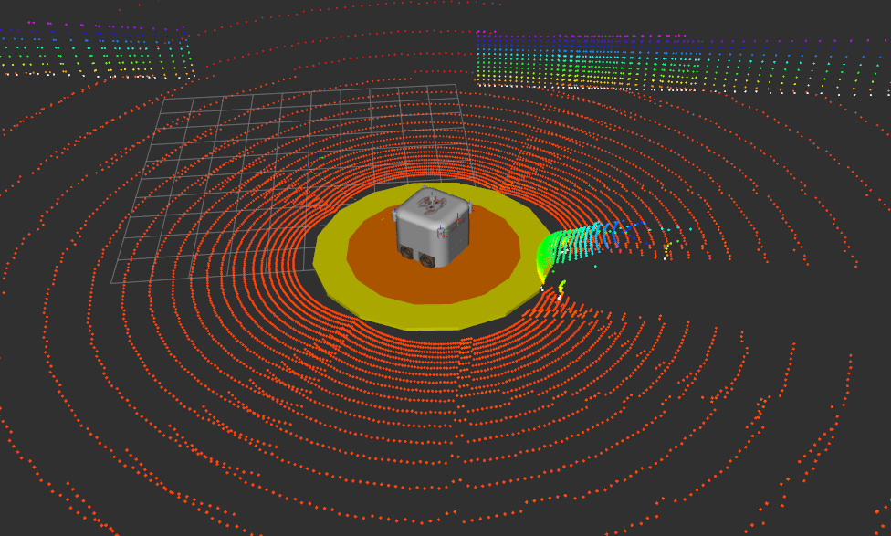
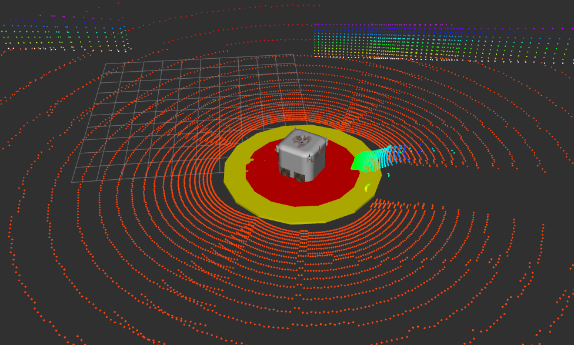
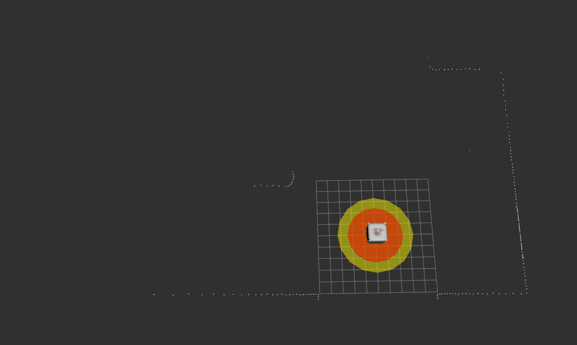
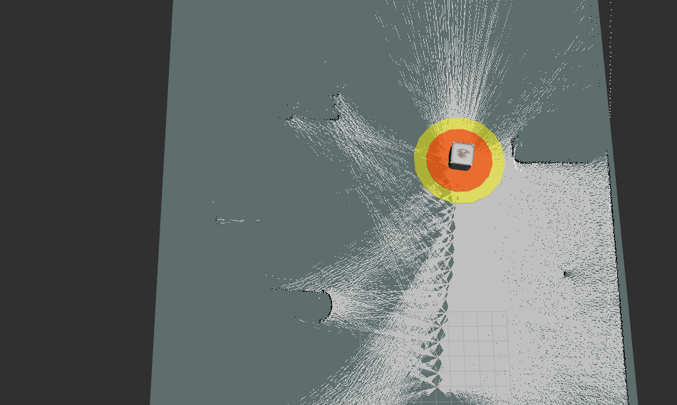
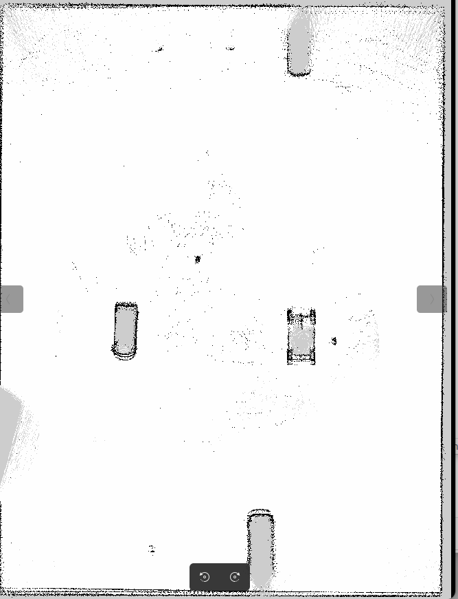
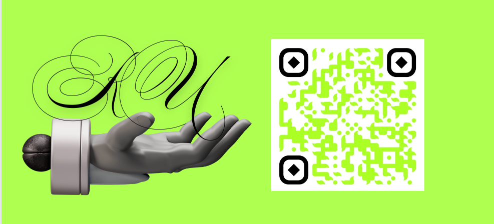

# ros2_deliverybot_ws

### ROS2 DeliveryBot: Autonomous Delivery 
Welcome to the ROS2 DeliveryBot project
I'm developing an autonomous Ackermann steering-controlled delivery robot. All 3D models are custom-made by the author.


### DeliveryBot

This project's goal is to create an autonomous (and possibly the cutest) 4 wheeled Ackermann Steering DeliveryBot that aims to navigate from a parking lot to another goal position, avoiding fixed and moving obstacles. Also, it will be able to perform non holonomic parking.

Final goal is to spawn multiple DeliveryBots and perform fleet management.





#### ParkingLot world
In this project we use a self-made world depicting a Parking Lot.




#### What's ready:
- Robot Urdf description
- Ackermann steering control
- Joystick teleoperation 
- Imu integration
- 3D lidars integration (4 lidars, that get fused in a single pointcloud - deliverybot_sensors/lidar_fusion_node.py)
- Depth camera integration
- Twistmux for input management. Joystick and Keyboard inputs available
- Twistmux safety stop (danger zone) and speed decrease (warning zone)
- Added a mesh for the central lidar link (fused pointcloud)
- Added a node to extract 2D LaserScan from the 3D fused PointCloud, for mapping purposes
- SLAM implementation (Localization and Mapping) with Graph Slam from Slam toolbox


#### What's coming:
- Improve odometry
- Navigation
- Additional navigation input to TwistMux
- Computer vision for mobile obstacle and parking lines detection
- Path Planning
- Behavioral Planning
- Parking functionalities
- Multiple robot spawning
- Call to action from 'head' robot to 'slaves' robots

#### Commits History
- first commit: description, ackermann control, teleoperation
- second commit: lidars, depth camera
- third commit: twistmux and safety stop
- fourth commit: laserscan and slam

#### Snapshots
Lidar pointcloud and dept camera


Speed decrease if object is detected in warning zone distance. Rviz Markers visualization.


Twistmux Safety Stop if object is detected in danger zone distance. Rviz Markers visualization.


2D LaserScan extracted from the fused 3D Pointcloud


Mapping view in Rviz2, Graph Slam


The map obtained from Graph Slam

### Build the workspace
```
cd ros2_deliverybot_ws
colcon build
source ./install/setup.bash
```

### Launch the latest implementation
```
(empty world)
ros2 launch deliverybot_bringup deliverybot.launch.py

(ParkingLot world)
ros2 launch deliverybot_bringup deliverybot.launch.py world_name:=ParkingLot

```

### Acknowledgment

This project is part of my portfolio. You can check out more of my work at [Robotics Unveiled / Greta Russi Portfolio ](https://www.roboticsunveiled.com/portfolio/).



